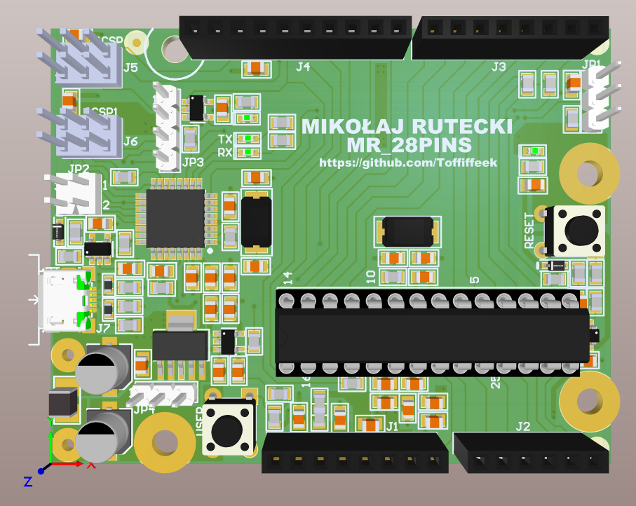
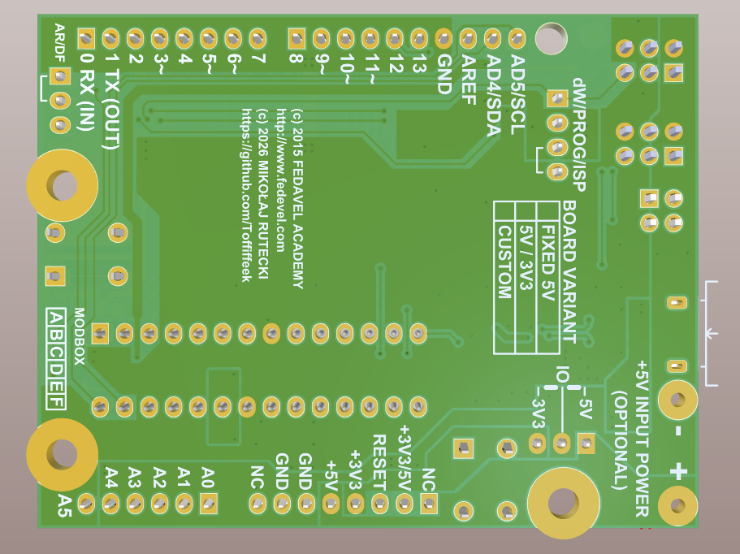

# Arduino-Compatible Microcontroller Board (MR_28PINS)

A custom PCB design of an Arduino-compatible microcontroller development board, created in Altium Designer as part of the **Learn to design your own boards** course by Robert Feranec on Udemy.

The project follows the general design approach and educational concepts presented during the course, while the schematic, PCB layout, custom schematic symbols, and PCB footprints were independently created as part of the learning process.

## Project Overview

The goal of this project was to design a complete Arduino-compatible development board while gaining practical experience with professional PCB design workflows.

The project covers the complete design process, including:

- Schematic design
- Component selection
- Custom schematic symbols
- Custom PCB footprints
- PCB component placement
- PCB routing
- Design Rule Checking (DRC)
- Component dimension verification
- Preparation of the board for manufacturing

The design is based on the general hardware concept of the **28PINS** Arduino-compatible board developed by **Fedavel Academy**, which was used as the hardware reference for the course.

The project was **not created by copying or importing the original schematic or PCB design**. All schematic drawings, symbols, and 2D PCB footprints used in this project were created from scratch.

## Design Approach

The board was developed following the design principles and workflow demonstrated in Robert Feranec's *Learn to design your own boards* course.

While the overall architecture follows the concepts demonstrated in the course, several aspects of the design were independently modified and adapted.

### Custom PCB Footprints

All PCB footprints used in the project were created from scratch, with the exception of 3D models.

The footprints were created based on the actual mechanical dimensions and datasheets of the selected components.

This was particularly important because several components differ from those used in the reference design in:

- Package dimensions
- Pin spacing
- Physical size
- Electrical parameters
- Mechanical characteristics

These differences were taken into account when designing the corresponding PCB footprints.

### Custom Schematic Symbols

All schematic symbols used in the project were created from scratch rather than copied from the reference design.

This provided practical experience with creating custom symbols and ensuring that their pin configuration and graphical representation correctly correspond to the selected components.

### Component Selection

Several components were replaced with alternative parts compared with those used in the reference design.

The replacements were selected based on factors such as:

- Electrical parameters
- Package type
- Physical dimensions
- Component availability
- Compatibility with the rest of the design

The corresponding PCB footprints were then adapted to the selected components.

### Clock Indicator LED

The clock indicator LED circuit was modified compared with the course/reference implementation.

The logic was changed to more closely reproduce the behavior of the indicator LED used in the original Arduino design.

This was an additional design modification made during the development of the board.

## Tech Stack

- **Altium Designer** — schematic capture, PCB layout, custom symbols, custom footprints and design verification
- **Component Datasheets** — electrical and mechanical reference for component selection and footprint creation

## What I Practiced

This project allowed me to practice the complete PCB development workflow, including:

- Reading and interpreting component datasheets
- Creating schematic symbols
- Creating PCB footprints from mechanical drawings
- Selecting alternative components
- Translating datasheet dimensions into PCB geometry
- Schematic-to-PCB workflow
- PCB component placement
- PCB routing
- Design Rule Checking (DRC)
- Maintaining consistency between schematic and PCB design
- Making independent hardware design decisions

## Reference & Educational Material

This project was developed as part of the **Learn to design your own boards** course by Robert Feranec on Udemy.

The hardware concept used throughout the course is based on the **28PINS Arduino-compatible board** developed by **Fedavel Academy**.

The course and reference design were used as **educational references and design inspiration**. The implementation contained in this repository was independently created for educational purposes.

Please refer to the included `LICENSE` file for the applicable licensing and attribution information.

## Future Improvements

- Manufacturing preparation
- Hardware bring-up and testing
- Firmware development
- Functional testing of the completed board
- Possible design revisions based on hardware testing
- USB-C variant

## Author

**MIKOŁAJ RUTECKI**
